- [01 Apartado de proyectos de github](#01-apartado-de-proyectos-de-github)
- [02 Creación del proyecto](#02-creación-del-proyecto)
- [03 Seleccionar template](#03-seleccionar-template)
- [04 Configuración del proyecto](#04-configuración-del-proyecto)
- [05 Nombre del proyecto](#05-nombre-del-proyecto)
- [06 Configuración de estados](#06-configuración-de-estados)
- [07 Cambio de iteraciones a sprint](#07-cambio-de-iteraciones-a-sprint)
- [08 Ajuste en current iteration](#08-ajuste-en-current-iteration)
- [09 Grabar cambios](#09-grabar-cambios)
- [10 Eliminar Next iteration](#10-eliminar-next-iteration)
- [11 Cambio de la vista Planning](#11-cambio-de-la-vista-planning)
- [12 Verificar vinculación del proyecto](#12-verificar-vinculación-del-proyecto)

# GitHub Project

Instrucciones para la creación de un GitHub Project

# 01 Apartado de proyectos de github

Desde la página inicial de tu repositorio, seleccionar el apartado de  `Projects`

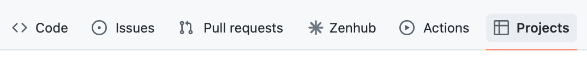

# 02 Creación del proyecto

En el botón `Link a project`, seleccionar la opción `New project` y una vez seleccionado hacer click

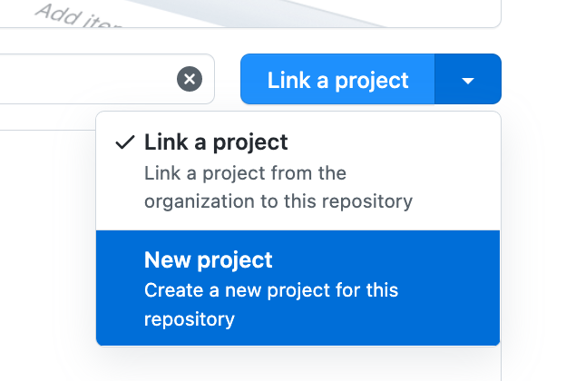

# 03 Seleccionar template

De la columna izquierda seleccionar el template `Feature` y crear el proyecto

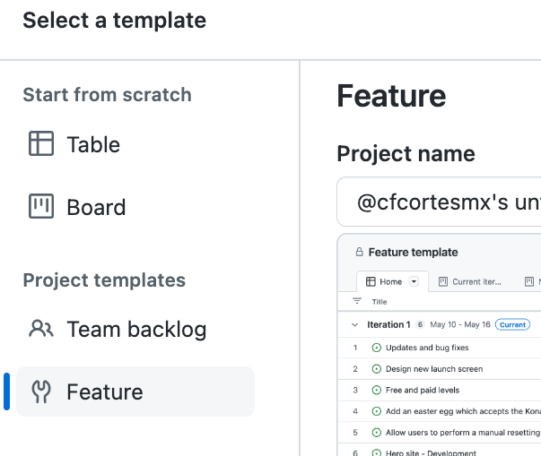

# 04 Configuración del proyecto

En la esquina superior derecha, en el menú  botón que tiene 3 puntos, seleccionar la opción `settings` 

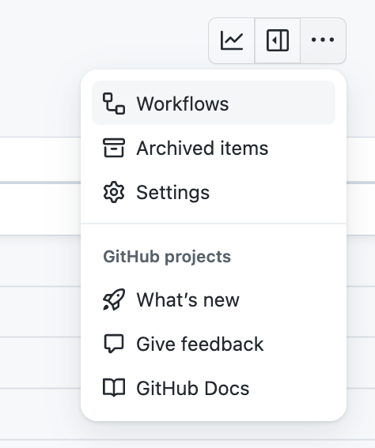

# 05 Nombre del proyecto

En la pantalla de configuración, asigna un nombre a tu proyecto. El nombre de tu proyecto debe ser único por lo que elegir un nombre que es común a otros equipos o generaciones como `Reloj Checador` ó `Equipo 1`, __no es aconsejable__. Puedes utilizar una combinación de el nombre de tu generación más algún distintivo, por ejemplo: `BCDIC22-Reloj Checador-Team 01`

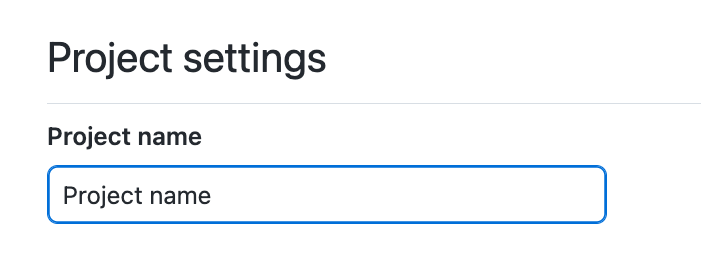

# 06 Configuración de estados

En la misma pantalla de configuración, del lado izquierdo, selecciona el  apartado de `Status`, en la sección de `Options`,  y actualiza los estados de la siguiente manera:

1. Elimina el estado `New`
2. Modifica el estado `Ready`por `Planned`

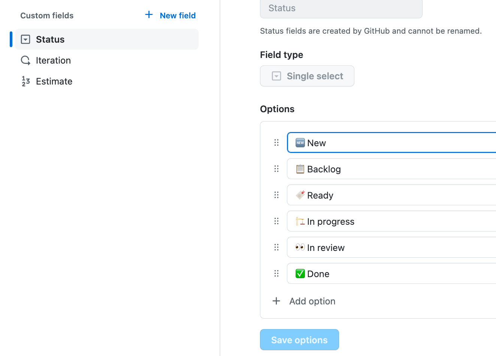

# 07 Cambio de iteraciones a sprint

En este paso, cambiaremos el concepto de iteraciones a sprint, para esto haz click en la opción 'Iteration' y realiza los siguientes cambios:

- Cambia el campo `Field name` al valor de `Sprint`
- Ajusta los nombres de las iteraciones a `Sprint 1`, `Sprint 2`, `Sprint 3` y `Sprint 4`
- Ajusta las fechas para cada sprint. Toma enb cuenta que los sprint inician los `Lunes` y terminan los `Viernes`, `Sábado y Domingo` no se deben considerar.
  
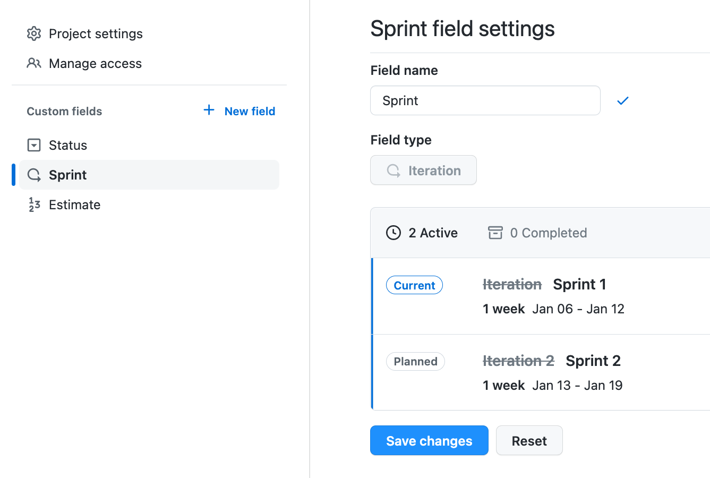

# 08 Ajuste en current iteration

Sal de la pantalla de configuración y regresa a la pantalla principal del proyecto. Selecciona el tabulador `Current iteration` y realiza los siguientes cambios:

- Cambia el título de `Current iteration` a `Current sprint`
- Cambia el filtro de `iteration:@current` a `sprint:@current`

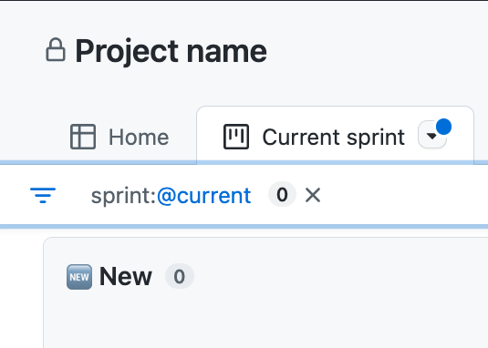

# 09 Grabar cambios

Para que los cambios que realizaste en el paso anterior se conserven es necesario que los grabes. Puedes observar que en la pestaña de `Current sprint` aparece un punto azul, esto indica que se hicieron cambios pero que aún no se han grabado.

Para grabarlos, selecciona el menú de la pestaña y hasta la parte de abajo seleccionar la opción `Save changes`

__IMPORTANTE:__ No confundir la opción `Save changes` con la opción `Save changes to  new view`,ya que tienen propósitos diferentes

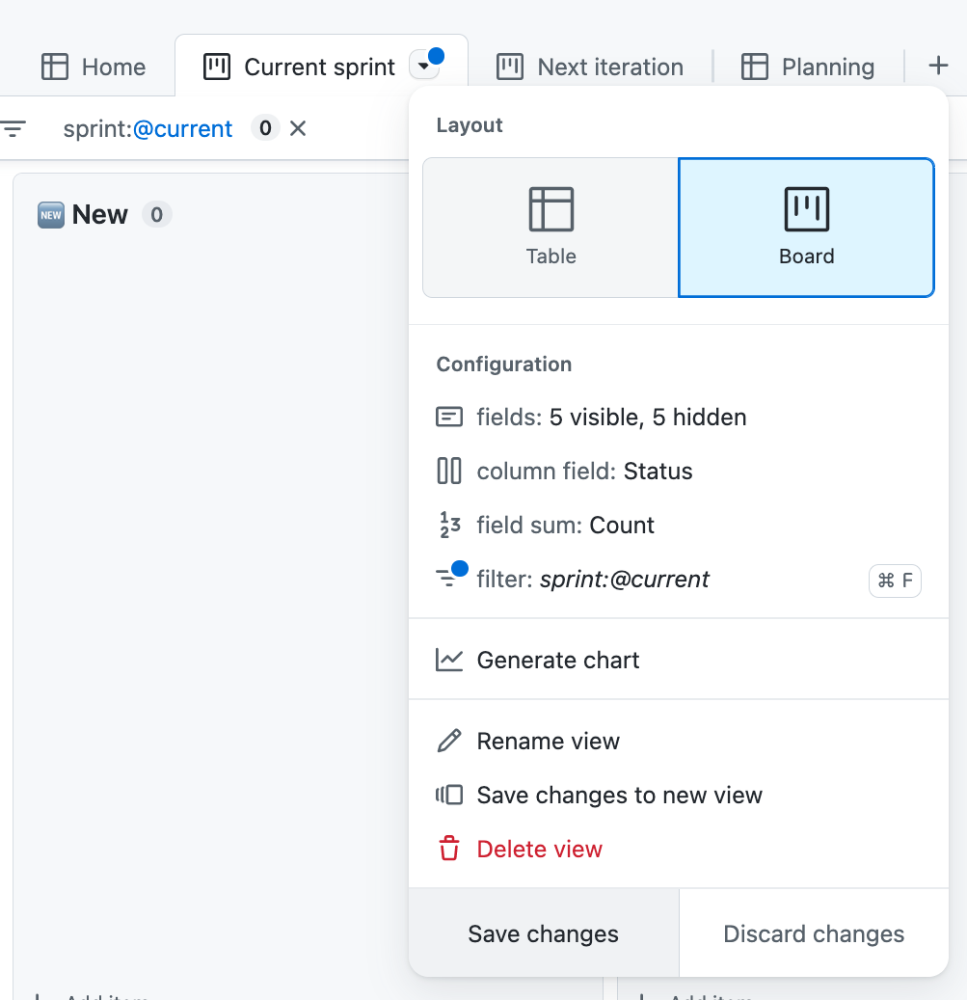

# 10 Eliminar Next iteration

Selecciona el tabulador `Next iteration`, haz click en la pestaña y selecciona la opción `Delete view`

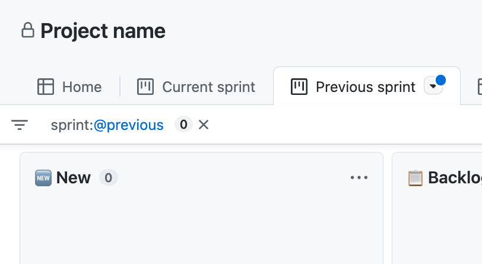

# 11 Cambio de la vista Planning

Selecciona el tabulador `Planning` y realiza los siguientes cambios:

1. Haz click en la pestaña y selecciona el layout `Group by Status`
2. Haz click de nuevo en la pestaña y ahora selecciona fields y marca los campos `milestone`y `Linked pull requests`
3. Haz click en la pestaña y selecciona la opción `Save changes`

# 12 Verificar vinculación del proyecto

Regresa al apartado de `Projects` de tu repositorio de GitHub y asegúrate de que tu proyecto aparezca vinculado.

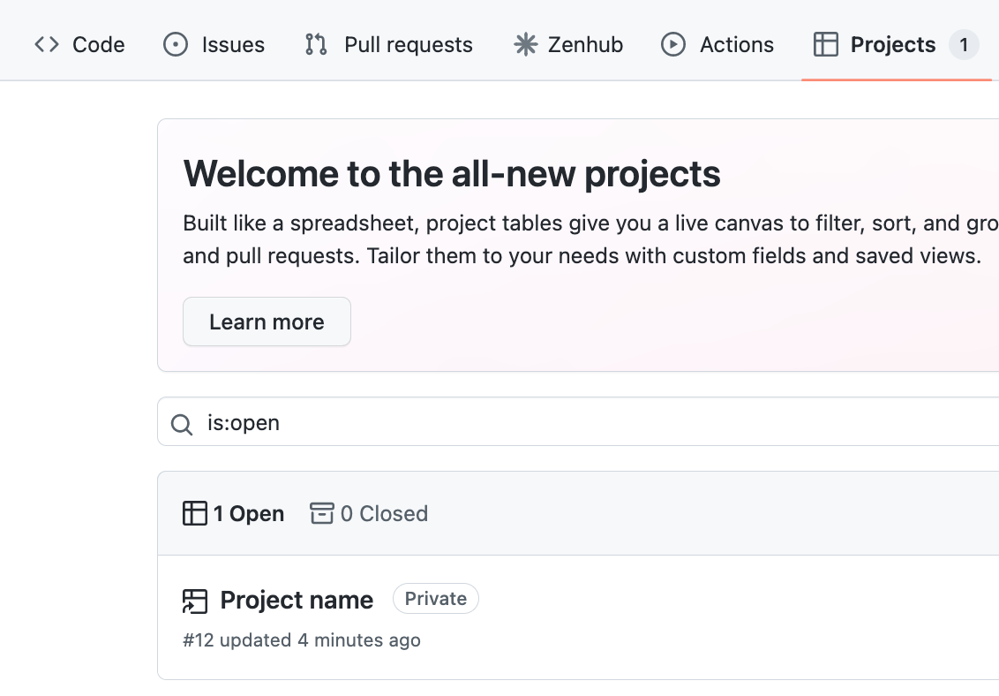
